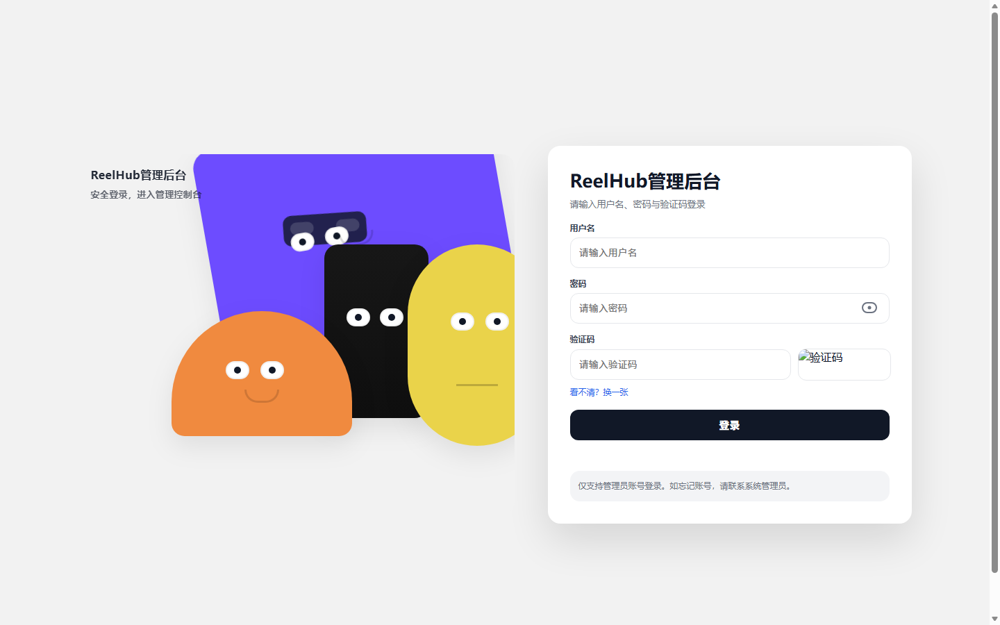
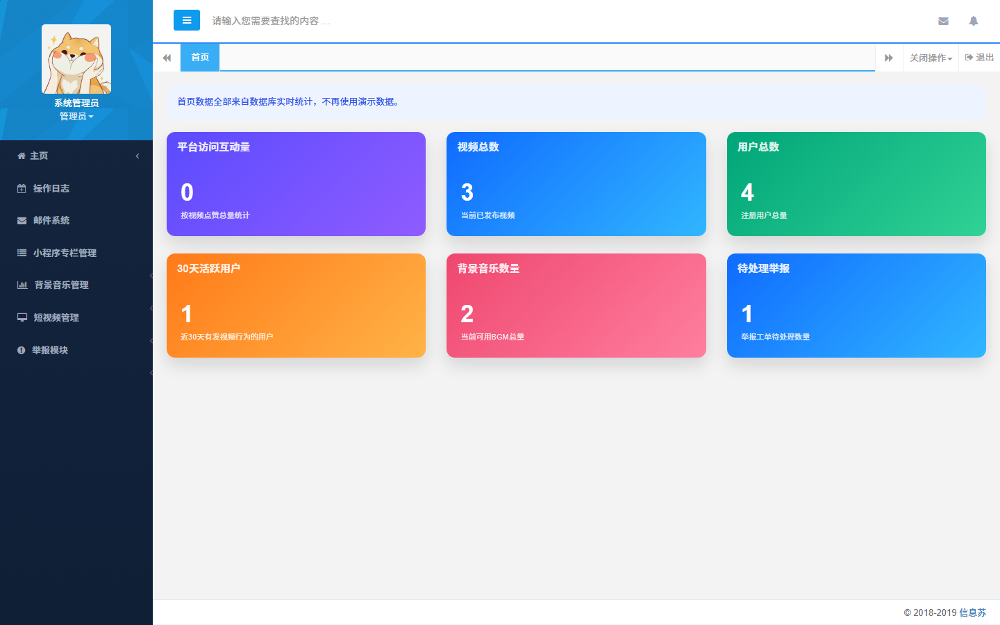

# ReelHub - AI短视频创作与社交平台

ReelHub 是一个面向短视频创作、浏览与互动的微信小程序 + Java 后端 + 后台管理系统项目。项目覆盖短视频上传、浏览、点赞、评论、关注、举报、背景音乐选择、后台内容管理、权限控制、视频问答等功能，适合作为 Java 后端、微信小程序、微服务架构和 AI 多模态应用方向的实习作品集项目。

## 项目亮点

- 微信小程序端提供短视频信息流、用户主页、上传、评论、点赞、关注、搜索、举报等完整社交功能。
- 后端采用 Spring Boot + MyBatis + MySQL + Redis，拆分出小程序 API、后台管理、服务注册与配置中心等模块。
- 后台管理系统支持用户、视频、背景音乐、分类、角色权限、举报记录等管理能力。
- 集成 FFmpeg 处理视频关键帧，为 AI 视频问答提供画面输入。
- 接入通义千问多模态接口，可根据视频关键帧和用户问题生成回答。
- 使用 Apache Shiro 做后台权限控制，配合拦截器、日志 AOP、XSS/SQL 过滤提升系统安全性。
- 项目包含 SQL 初始化脚本、管理端页面、小程序端页面和演示素材，便于展示完整业务闭环。

## 功能模块

### 微信小程序端

- 用户注册、登录、退出
- 短视频首页信息流
- 视频详情页、点赞、取消点赞
- 评论发布与评论列表
- 用户关注、取消关注
- 个人主页与头像上传
- 视频上传与背景音乐选择
- 热门视频搜索
- 视频举报
- AI 视频问答入口

### 小程序后端 API

- 用户认证与用户资料接口
- 视频上传、列表、详情、点赞、评论、举报接口
- 背景音乐与分类接口
- Redis 缓存支持
- FFmpeg 视频处理
- Qwen 多模态视频问答

### 后台管理系统

- 管理员登录
- 用户管理
- 视频管理与内容审核
- 背景音乐管理
- 视频分类管理
- 角色与权限管理
- 举报记录处理
- 操作日志记录
- 数据列表分页与筛选

### 微服务基础模块

- Eureka 服务注册中心
- Spring Cloud Config 配置中心
- 小程序 API 多模块 Maven 工程
- 通用工具、实体、Mapper、Service 分层

## 技术栈

### 后端

- Java 8
- Spring Boot 1.5
- Spring Cloud Eureka
- Spring Cloud Config
- Spring MVC
- MyBatis
- MySQL
- Redis
- Apache Shiro
- PageHelper
- Swagger2
- Druid
- FFmpeg
- 通义千问 / DashScope 多模态 API
- Maven

### 前端与小程序

- 微信小程序
- WXML / WXSS / JavaScript
- Thymeleaf
- Bootstrap
- jQuery
- Bootstrap Table
- Layer
- WebUploader

## 项目结构

```text
.
├── scetc-show-videos-admin        # 后台管理系统
├── scetc-show-videos-cloud        # Eureka 服务注册中心
├── scetc-show-videos-config       # Spring Cloud Config 配置中心
├── scetc-show-videos-dev          # 小程序后端多模块工程
│   ├── scetc-show-videos-dev-commons
│   ├── scetc-show-videos-dev-mapper
│   ├── scetc-show-videos-dev-pojo
│   ├── scetc-show-videos-dev-service
│   └── scetc-show-videos-mini-api # 小程序 API 服务
├── scetc-show-videos-page         # 微信小程序端
├── show-videos-mini               # 小程序历史版本/展示版本
├── sql                            # 数据库脚本
├── gif                            # 项目演示动图
└── myimg                          # 项目截图与架构图
```

## 运行截图

### 后台登录页



### 后台管理首页



## 环境要求

- JDK 1.8
- Maven 3.6+
- MySQL 5.7+
- Redis 3.0+
- 微信开发者工具
- FFmpeg
- 可选：DashScope / 通义千问 API Key

## 快速开始

### 1. 初始化数据库

创建数据库：

```sql
CREATE DATABASE scetc_show_video_dev DEFAULT CHARACTER SET utf8mb4 COLLATE utf8mb4_general_ci;
```

执行 SQL 脚本：

```text
sql/scetc-show-video-dev-complete.sql
```

或根据需要使用：

```text
scetc_show_video_dev_clean.sql
```

### 2. 修改后端配置

后台管理系统配置：

```text
scetc-show-videos-admin/src/main/resources/application.properties
```

小程序 API 配置：

```text
scetc-show-videos-dev/scetc-show-videos-mini-api/src/main/resources/application.properties
```

需要按本地环境修改：

```properties
spring.datasource.url=jdbc:mysql://localhost:3306/scetc_show_video_dev?characterEncoding=utf8&useSSL=false
spring.datasource.username=your_mysql_username
spring.datasource.password=your_mysql_password

spring.redis.host=127.0.0.1
spring.redis.port=6379
spring.redis.password=

web.upload.path=./runtime-upload/videos
ffmepg.path=/path/to/ffmpeg

qwen.api.key=your_dashscope_api_key
```

### 3. 启动基础服务

启动服务注册中心：

```bash
cd scetc-show-videos-cloud
mvn spring-boot:run
```

启动配置中心：

```bash
cd scetc-show-videos-config
mvn spring-boot:run
```

### 4. 启动小程序 API

```bash
cd scetc-show-videos-dev
mvn clean package -DskipTests
cd scetc-show-videos-mini-api
mvn spring-boot:run
```

默认 API 地址：

```text
http://127.0.0.1:8080
```

### 5. 启动后台管理系统

```bash
cd scetc-show-videos-admin
mvn spring-boot:run
```

默认后台地址：

```text
http://127.0.0.1:8082
```

### 6. 导入微信小程序

使用微信开发者工具导入：

```text
scetc-show-videos-page
```

如果后端端口或上下文路径发生变化，请修改：

```text
scetc-show-videos-page/app.js
```

## 配置安全说明

- 仓库中的数据库密码、Redis 密码、API Key、小程序 AppID 均已改为占位符或游客配置。
- 真实密钥请只保存在本地配置、环境变量或私有部署平台中。
- `.gitignore` 已排除 IDE 配置、编译产物、运行时上传目录、临时文件和私有项目配置。
- 如果真实密钥曾经被提交到公开仓库，建议立即在对应平台重新生成密钥。

## 适合展示的能力点

- Java Web 分层开发
- Spring Boot 后端接口开发
- MyBatis 数据持久化
- Redis 缓存使用
- 微信小程序开发
- 后台权限管理与内容审核
- FFmpeg 视频处理
- AI 多模态接口集成
- 微服务基础组件使用

## 后续优化方向

- 升级 Spring Boot 与 Spring Cloud 版本。
- 增加统一异常处理、参数校验与接口测试。
- 使用对象存储替代本地文件存储。
- 增加 Docker Compose，一键启动 MySQL、Redis 和后端服务。
- 增加短视频推荐、标签体系和搜索排序能力。
- 将 AI 视频问答能力扩展为自动标题、摘要和标签生成。
